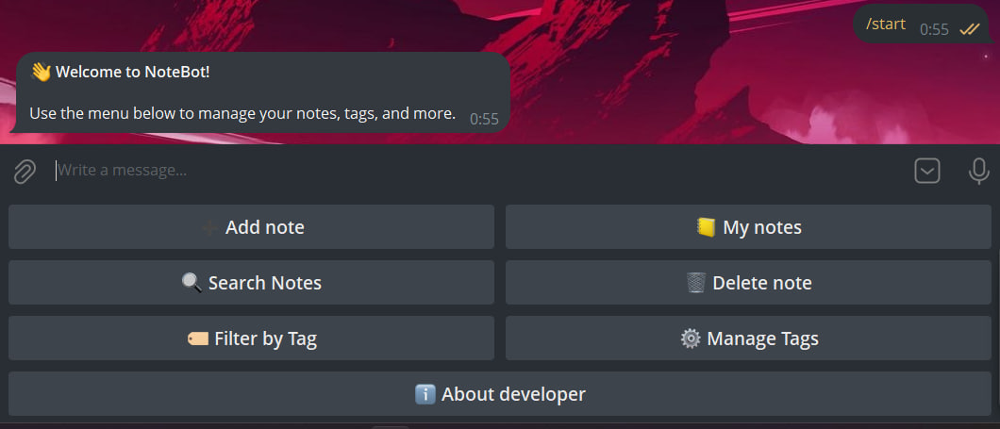
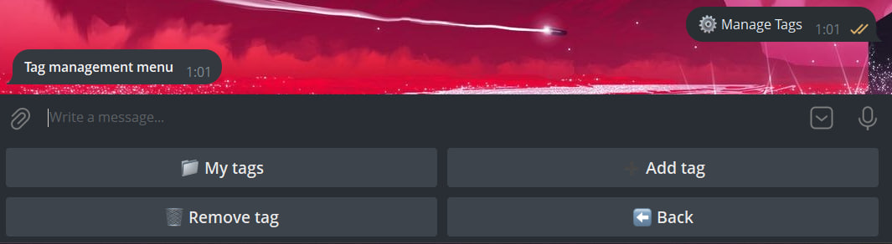
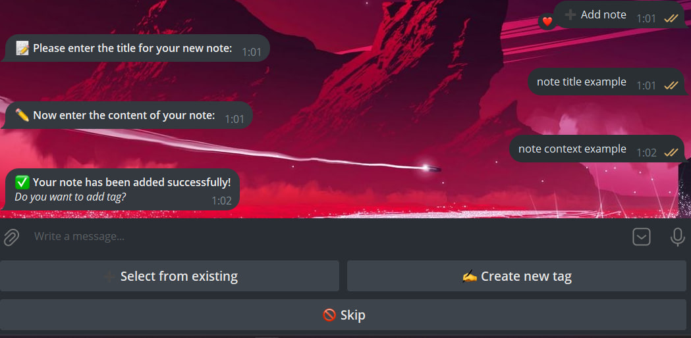
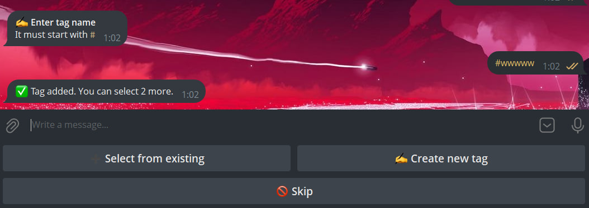
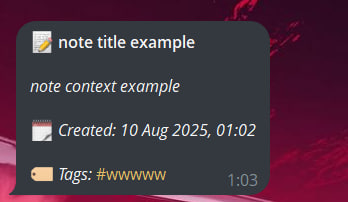
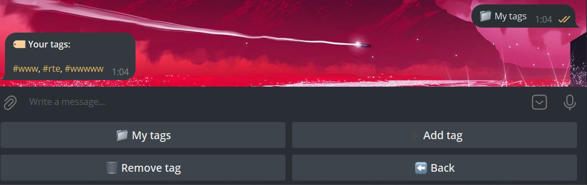
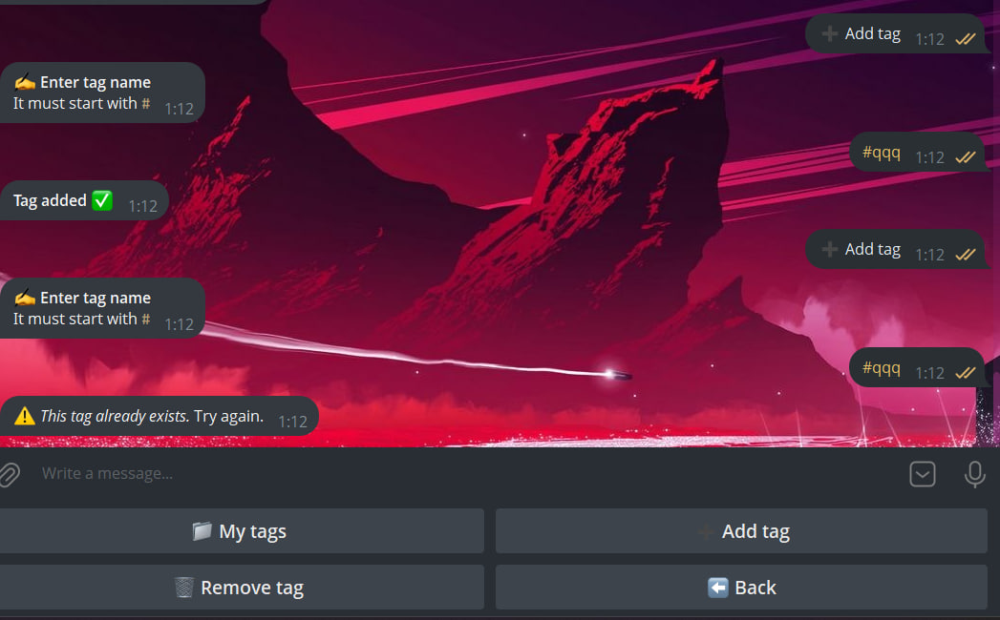
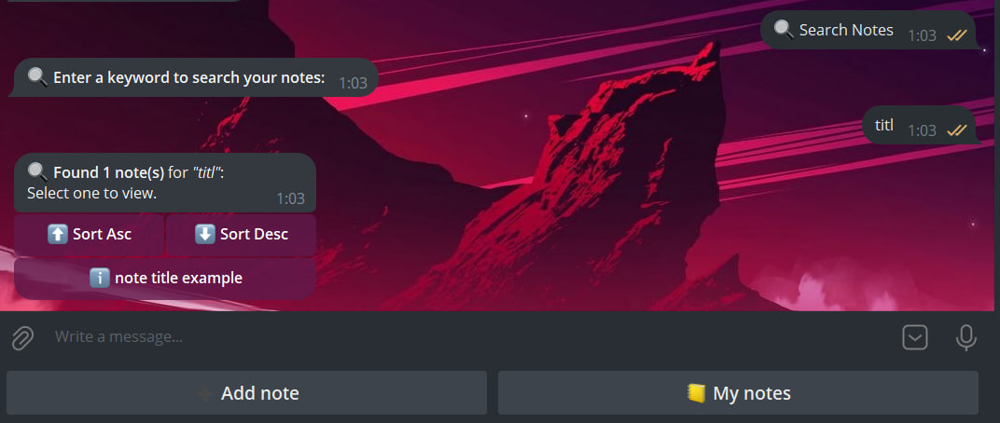
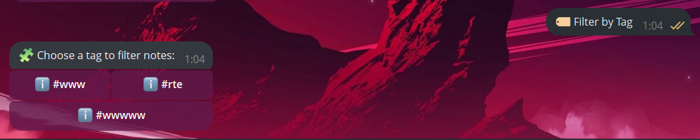

# TelegramNoteBot

A simple Telegram bot for creating, viewing, sorting, and deleting notes with tag support.

## Features
- Add and edit notes
- Sort notes by date (ascending/descending)
- Filter notes by tags
- Delete notes and tags
- Uses Redis for caching callback data
- Stores data in PostgreSQL

## Requirements
- .NET 8.0
- PostgreSQL
- Redis
- Telegram Bot Token

## Quick Start

1. Clone the repository:
    ```
    git clone https://github.com/your-username/TelegramNoteBot.git
    cd TelegramNoteBot
    ```

2. Set your bot token in `appsettings.json`.

3. Configure database connection in `appsettings.json`:
    ```json
    "ConnectionStrings": {
        "Redis" : "redis:YOU_PORT",
        "Connection" : "Host=YOU_HOST;Port=YOU_PORT;Database=YOU_DATABASE;Username=YOU_USERNAME;Password=YOU_PASSWORD"
      },
      "Telegram": {
        "Token" : "YOU_BOT_TOKEN"
      }
    ```

4. Start PostgreSQL and Redis locally or using Docker.

5. Run the bot:
    ```
    dotnet run --project TelegramNoteBot
    ```

## Running with Docker

1. **Clone the repository**  
   ```bash
   git clone https://github.com/yourusername/telegram-note-bot.git
   cd telegram-note-bot
   ```

- Edit docker-compose.yml
    Update the environment section in the bot service with your real bot token and database credentials:
    ```bash
    version: "3.9"
    
    services:
      bot:
        build:
          context: .
          dockerfile: TelegramNoteBot/Dockerfile
        container_name: telegram_note_bot
        depends_on:
          - db
          - redis
        environment:
          ConnectionStrings__Connection: Host=db;Port=YOU_PORT;Database=YOU_DATABASE;Username=YOU_USERNAME;Password=YOU_PASSWORD
          Redis__Host: redis
          Redis__Port: YOU_REDIS_PORT
          BotConfiguration__Token: YOU_BOT_TOKEN
        restart: unless-stopped
    
      db:
        image: postgres:latest
        container_name: telegram_note_pg
        environment:
          POSTGRES_USER: YOU_USERNAME
          POSTGRES_PASSWORD: YOU_PASSWORD
          POSTGRES_DB: YOU_DATABASE
        ports:
          - "${YOU_PASSWORD}:5432"
        volumes:
          - pgdata:/var/lib/postgresql/data
    
      redis:
        image: redis:7-alpine
        container_name: telegram_note_redis
        restart: unless-stopped
        ports:
          - "${YOU_REDIS_PORT}:6379"
        volumes:
          - redis_data:/data
        command: redis-server --appendonly yes
    
    volumes:
      pgdata:
        driver: local
      redis_data:
        driver: local
    ```
  - Build and start services
    ```bash
    docker compose up --build -d
    ```
## Screenshots

### Main Menu


### Tag Management Menu


### Create Note Example

After you have created a note, a menu will pop up in the bot that will allow you to add tags to the note
This menu offers you to add existing tags or create your own tags, you can skip this action.

### Add Tag to Note

After adding a tag, we see that we can add two more, since the limit is 3 tags per note.

### Note Example


### View tags

Here we can see all the tags that we have used in any way. Both by yourself and when creating a note.

### Create tags

The created tag must necessarily begin with #, and they cannot be duplicated.

### Search notes

After entering the keyword, we see how our note was searched. The search is performed both by the title of the note and its context.

### Filtering by tags

A selection menu appears with the tags available to us. By selecting one, we will be shown all the notes where this tag has been added.

## Contacts
- Developer: Dmytro Stozhok  
- GitHub: [https://github.com/dist22](https://github.com/dist22)
